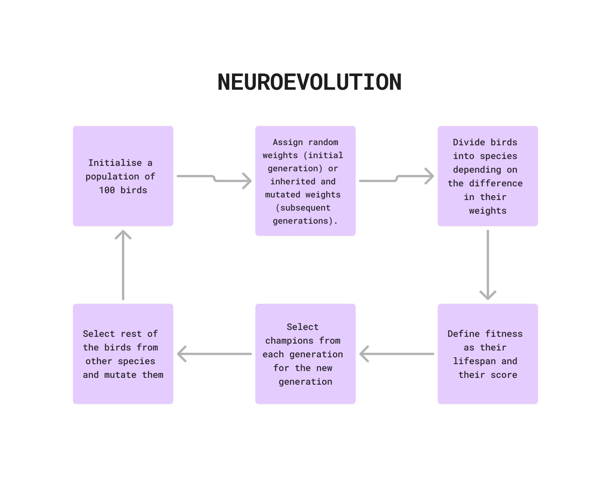

# Reinforcement Learning Flappy Bird (From Scratch)

This is an implementation of reinforcement learning which learns to play Flappy bird game which utilises Neuroevolution with fixed topologies to enable the neural network to learn to play the game. However, this is still in development stage and I couldn't get the neural net to learn properly.

## How it works

### Neural Network
This game uses the simplest neural network which is called a Perceptron.

  

### Neuroevolution
Neuroevolution involves evolving neural networks using genetic algorithms. Here’s a brief overview of the process.

  

